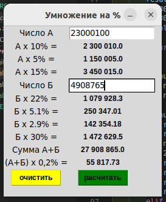

### Калькулятор для экономии времени при расчетах страховых взносов!


#### Написана с использованием библиотеки tkinter

#### Для создания exe файла нужен pyinstaller

```bash
pip install pyinstaller 
```
Далее переходим в командной строке в директорию проекта 

```bash
pyinstaller -F -w name.py
```
и получаем exe файл который запустится на компьютере.

вот так он будет выглядеть.

